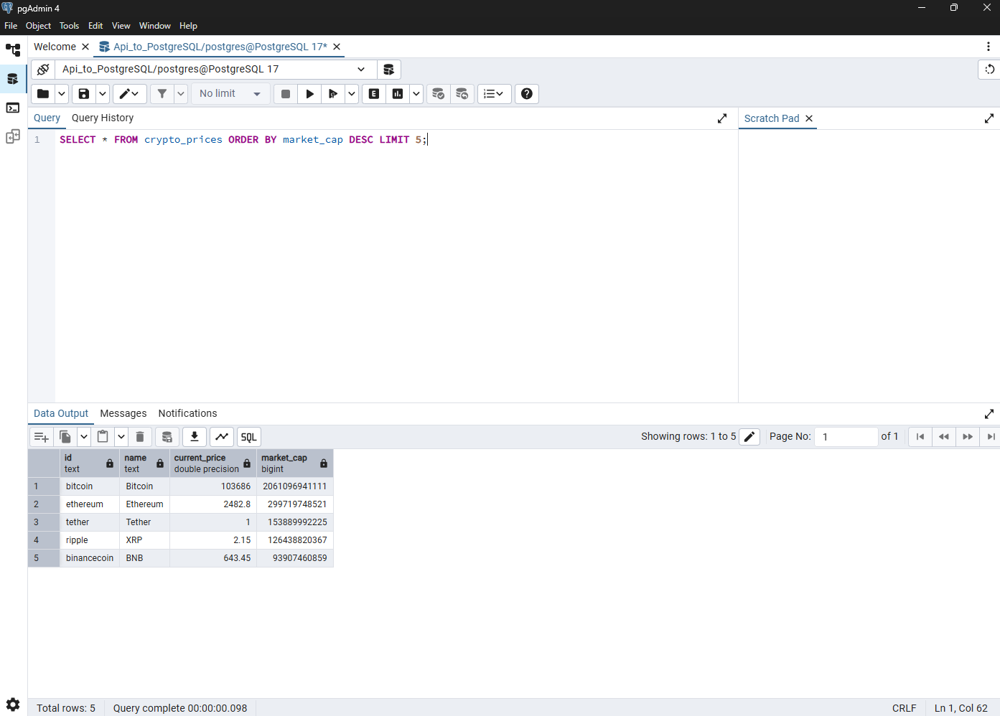

# Cryptocurrency Data Pipeline: API to PostgreSQL

## Project Overview
This project implements a simple data pipeline that extracts cryptocurrency market data from a public API and loads it into a PostgreSQL database. The pipeline handles real-time cryptocurrency data including prices and market capitalization, using Python for ETL (Extract, Transform, Load) processes.

## Prerequisites
- PostgreSQL installed and running
- pgAdmin 4 for database management
- Python 3.8 or higher

## Project Objective  
- Practice API connection and data extraction using Python `requests`  
- Store structured data into PostgreSQL using `psycopg2`  
- Manage environment variables securely with `.env` files  
- Prepare foundational skills for Data Engineer and Backend Data Handling  

## Data Flow Diagram  
```plaintext
[API] → [Python Script (requests, pandas)] → [CSV File] → [PostgreSQL Database]
```

## Components
- Python script for API data extraction
- PostgreSQL database for data storage
- pgAdmin 4 for database management
- Environment variables for secure configuration 

## 🗃️ Database Structure

**Database:** `Api_to_PostgreSQL`  
**Table:** `crypto_prices`

| Column Name    | Data Type        | Description                      |
|:---------------|:-----------------|:---------------------------------|
| `id`            | TEXT              | Cryptocurrency identifier        |
| `name`          | TEXT              | Cryptocurrency name              |
| `current_price` | DOUBLE PRECISION  | Current price in USD             |
| `market_cap`    | BIGINT            | Market capitalization in USD     |

---

## 🛠️ Tools & Libraries

- **Python 3.x**
- **PostgreSQL**
- **pgAdmin 4**
- **Jupyter Notebook**
- **Python Libraries**
  - `psycopg2`
  - `pandas`
  - `requests`
  - `python-dotenv`

---

## Setup Instructions
1. Clone the repository
2. Create a `.env` file with your database credentials
3. Install required Python packages
4. Run the Jupyter notebook `API_to_postgreSQL.ipynb`

## Files Description
- `API_to_postgreSQL.ipynb`: Main pipeline implementation
- `crypto_data.csv`: Backup/cache of cryptocurrency data
- `.env`: Configuration file for database credentials
- `.gitignore`: Specifies which files Git should ignore

## Environment Variables
Create a `.env` file in the root directory with the following format:
DB_HOST=localhost
DB_PORT=5432
DB_NAME=Api_to_PostgreSQL
DB_USER=your_username
DB_PASSWORD=your_password

## Using pgAdmin 4
- Open pgAdmin 4 and connect to your PostgreSQL server.
- Navigate to the `Api_to_PostgreSQL` database.
- Run SQL queries to view or manipulate data.

## pgAdmin Query Result
Here is an example of the query result in pgAdmin 4:


## Future Enhancements
- Add data visualization using tools like Tableau or Power BI.
- Automate the pipeline for scheduled updates.